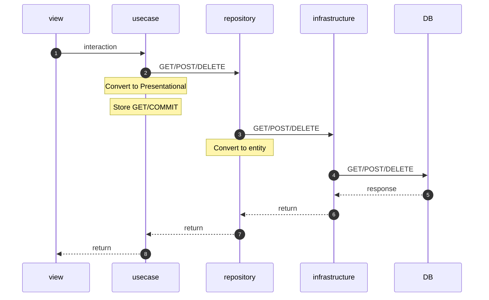

# Data Flow

```mermaid
sequenceDiagram
  autonumber
  view->>usecase: interaction
  usecase->>repository: GET/POST/DELETE
  Note over usecase: Convert to Presentational
  Note over usecase: Store GET/COMMIT
  repository->>infrastructure: GET/POST/DELETE
  Note over repository: Convert to entity
  infrastructure->>DB: GET/POST/DELETE
  DB-->>infrastructure: response
  infrastructure-->>repository: return
  repository-->>usecase: return
  usecase-->>view: return
```
